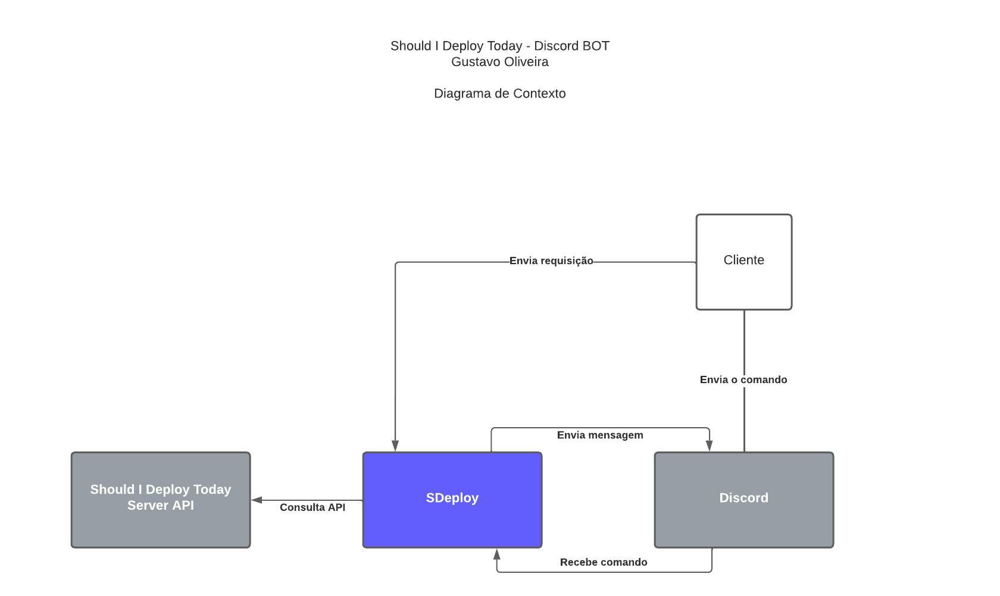
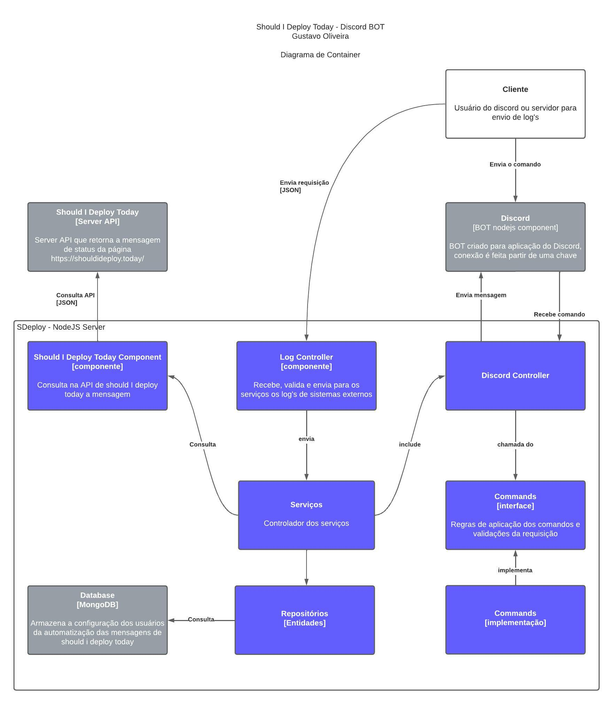

# Should I deploy today discord bot

## Contexto

Um simples BOT para retornar a mensagem de [Should I deploy today](https://shouldideploy.today/.). Pode-se também configurar lembretes e utilizar para enviar LOG's de um sistema externo para um determinado canal do servidor.
 

**O que é o Should I Deploy Today?**
 
Apenas um site cômico com mensagens criativas sugerindo ou não que você faça o deploy do sistema.
 
A API pode ser encontrada [aqui](http://shouldideploy.today/api?tz=America/Sao_Paulo).

## Utilização

Para adicionar o BOT no discord, acesse: [Discord](https://discord.com/api/oauth2/authorize?client_id=957157518772146258&permissions=3072&scope=bot%20applications.commands)

Para utilizar, use os comandos abaixo:
- **!deploy** Chamada manual da mensagem de Should I Deploy Today
- **!startLoop** Starts sending messages automatically every 24h
- **!stopLoop** Stops the automatic sending of messages

## Diagramas

### Contexto

### Container

